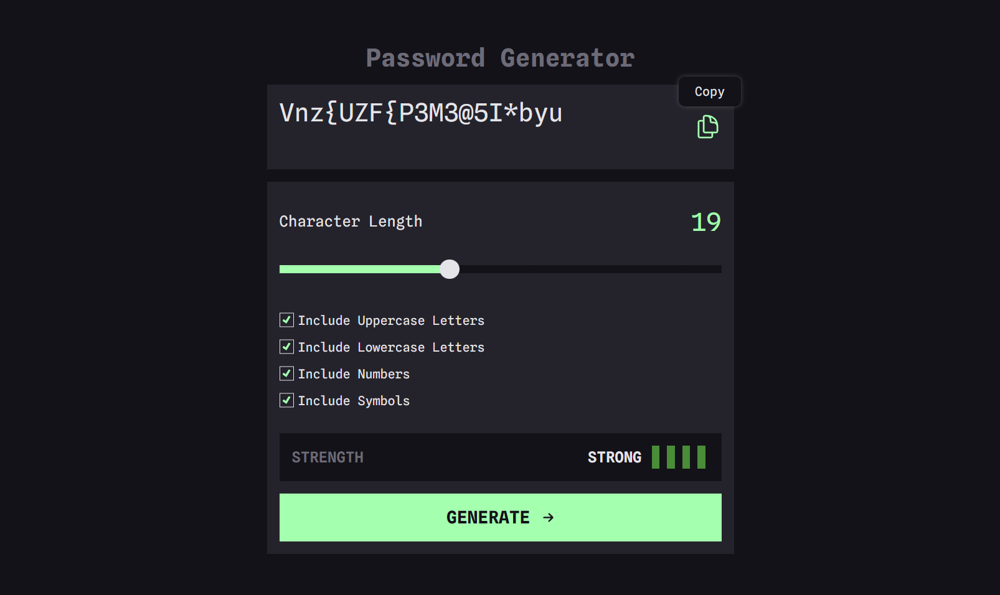

# Shortly - URL shortening API

This is a solution to the [E-commerce product page challenge on Frontend Mentor](https://www.frontendmentor.io/challenges/ecommerce-product-page-UPsZ9MJp6). This is project that generates passwords for user based on the selected inclusion options. Page is built with JS framework `Vue.js`, styles are written is `SCSS`. Strength of passwords are checked by javascript library [check-passwrod-strength](https://www.npmjs.com/package/check-password-strength). Page is fully responsive.

# 📝 Table of contents

- [Overview](#overview)
  - [The challenge](#the-challenge)
  - [Live Demo](#live-demo)
  - [Screenshot](#screenshot)
- [Tech stack](#tech-stack)
  - [Built with](#built-with)
- [Installation](#installation)
- [Author](#author)

# ✏️ Overview

Users should be able to:

- Generate a password based on the selected inclusion options
- Copy the generated password to the computer's clipboard
- See a strength rating for their generated password
- View the optimal layout for the interface depending on their device's screen size
- See hover and focus states for all interactive elements on the page

# 🟢 Live demo - [Password Generator](https://chris-ai.github.io/password-generator/)

# 📷 Screenshot



# 📚 Tech stack

## Built with

[](https://skills.thijs.gg)

# ➡️ Installation

```
npm install
```

### Compiles and hot-reloads for development

```
npm run serve
```

### Compiles and minifies for production

```
npm run build
```

### Lints and fixes files

```
npm run lint
```

# 🔗 Author

[](https://github.com/Chris-ai)

[](https://twitter.com/kondr7_krzysiek)

[](https://www.frontendmentor.io/profile/Chris-ai)
